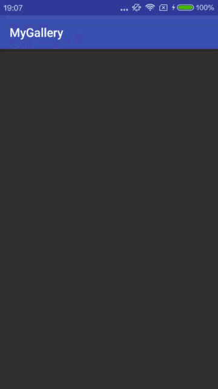

# My Gallery

## Preview

　　


## Introduction
After learning `RecyclerView`, `Retrofit`,`Gson` and `Glide`, I want to make an integration of all these libraries. And here comes this idea.

`Retrofit` does the data fetching, `Gson` does the data decoding, `Glide` does the display of images from network, and `RecyclerView` does the organization of display.

## Dependency
We need several libraries mentioned above, add lines of code in the `build.gradle` of your module and sync.

```Gradle
compile 'com.android.support:recyclerview-v7:24.2.1'
compile 'com.github.bumptech.glide:glide:3.7.0'
compile 'com.squareup.okhttp3:okhttp:3.4.1'
compile 'com.squareup.retrofit2:retrofit:2.1.0'
compile 'com.google.code.gson:gson:2.7'
compile 'com.squareup.retrofit2:converter-gson:2.1.0'
```

`OkHttp` is needed because `Retrofit` is based on it.

## Build JavaObject and Interface
Here I got an image `API` from [androidhive](http://api.androidhive.info/)

*[http://api.androidhive.info/json/glide.json](http://api.androidhive.info/json/glide.json)*

The result comes back in `Json`:

```Json
[
  {
    "name": "Deadpool",
    "url": {
      "small": "http://api.androidhive.info/images/glide/small/deadpool.jpg",
      "medium": "http://api.androidhive.info/images/glide/medium/deadpool.jpg",
      "large": "http://api.androidhive.info/images/glide/large/deadpool.jpg"
    },
    "timestamp": "February 12, 2016"
  },
  {
    "name": "Batman vs Superman",
    "url": {
      "small": "http://api.androidhive.info/images/glide/small/bvs.jpg",
      "medium": "http://api.androidhive.info/images/glide/medium/bvs.jpg",
      "large": "http://api.androidhive.info/images/glide/large/bvs.jpg"
    },
    "timestamp": "March 25, 2016"
  },
...
]
```

We create 2 `JavaObject` named `MoiveInfo` and `Url`:

```Java
public class MovieInfo {

    public String name;
    public Url url;

    @SerializedName("timestamp")		//remember to use the annotation when there is name mismatch.
    public String timeStamp;

}
```

```Java
public class Url {

    public String small;
    public String medium;
    public String large;

}
```

And create an `API interface` named `MovieInfoService`:

```Java
public interface MovieInfoService {

    @GET
    Call<ArrayList<MovieInfo>> movieInfoList(
            @Url String url
    );

}
```

*Check my posts [Gson](https://github.com/Mindjet/Way2Android/blob/master/Git-Github/github-api.md#decode-data) and [Retrofit](https://github.com/Mindjet/Way2Android/blob/master/HttpClient/retrofit-en.md#interface) to see why we need these 2 things.*

## Fetch and decode data
`Retrofit` is good at this.

```Java
private Retrofit mRetrofit;
private ArrayList<MovieInfo> mMovieInfoList;
private MovieInfoService mMovieInfoService;

...

private void fetchMovieInfo(String url) {

    mRetrofit = new Retrofit.Builder()
            .addConverterFactory(GsonConverterFactory.create())
            .baseUrl("https://api.github.com/")		//It is required but it will be ignored if given absolute path.
            .build();
    mMovieInfoService = mRetrofit.create(MovieInfoService.class);

    Call<ArrayList<MovieInfo>> movieInfoCall = mMovieInfoService.movieInfoList(url);
    movieInfoCall.enqueue(new Callback<ArrayList<MovieInfo>>() {
        @Override
        public void onResponse(Call<ArrayList<MovieInfo>> call, Response<ArrayList<MovieInfo>> response) {
            if (response.isSuccessful()) {
                mMovieInfoList = response.body();
                mFaceAdapter.setMovieInfoList(mMovieInfoList);
            }
        }

        @Override
        public void onFailure(Call<ArrayList<MovieInfo>> call, Throwable t) {
            t.printStackTrace();
        }
    });

}
```

See, we can simply get the data with `Retrofit` and decode the data with `GsonConverter`.

## Display Data
Before using `RecyclerView`, we need a `RecyclerView.Adapter`, let's name it `FaceAdapter`:

```Java
public class FaceAdapter extends RecyclerView.Adapter<FaceAdapter.FaceViewHolder>{

    private LayoutInflater mInflater;
    private List<MovieInfo> mMovieInfoList;
    private Context mContext;

    ...

    @Override
    public FaceViewHolder onCreateViewHolder(ViewGroup parent, int viewType) {
        return new FaceViewHolder(mInflater.inflate(R.layout.item_face, parent, false));
    }

    @Override
    public void onBindViewHolder(FaceViewHolder holder, int position) {

        Glide.with(mContext)
                .load(mMovieInfoList.get(position).url.medium)
                .centerCrop()
                .animate(R.anim.anim_zoom)
                .thumbnail(0.1f)
                .into(holder.mImageView);

    }

    public class FaceViewHolder extends RecyclerView.ViewHolder {

        ImageView mImageView;

        public FaceViewHolder(View itemView) {
            super(itemView);
            mImageView = (ImageView) itemView.findViewById(R.id.iv_face);
        }
    }
}
```

Fetch the image using url and show it on the `ImageView` with `Glide` in the method `onBindViewHolder`.

Now instantiate the `RecyclerView` and attach adapter to it:

```Java
mRecyclerView = (RecyclerView) findViewById(R.id.rv_gallery);
mRecyclerView.setLayoutManager(new GridLayoutManager(this, 2));
mFaceAdapter = new FaceAdapter(this);
mRecyclerView.setAdapter(mFaceAdapter);
```

*Check my repos [RecyclerView](https://github.com/Mindjet/Way2Android/blob/master/RecyclerView/recycler-view-1.md), [Glide](https://github.com/Mindjet/Way2Android/blob/master/ImageLoader/glide.md) and project [RecyclerView demo](https://github.com/Mindjet/RecyclerViewDemo).*

Now run the app and see what happen now!  
(Do remember to add `INTERNET` **permission** in your `AndroidManifest.xml`)



## Fullscreen
Coming soon.

